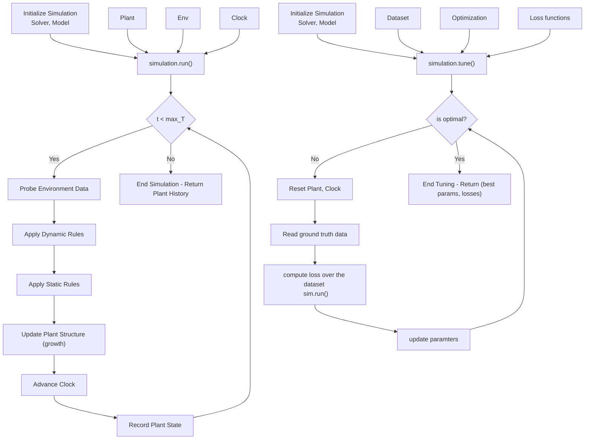

```mermaid

flowchart TD
    A["Initialize Simulation <br> Solver, Model"] --> B["simulation.run()"]
    B --> F{"t &lt; max_T"}
    F -- Yes --> G["Probe Environment Data"]
    G --> H["Apply Dynamic Rules"]
    H --> I["Apply Static Rules"]
    I --> J["Update Plant Structure (growth)"]
    J --> K["Advance Clock"]
    K --> L["Record Plant State"]
    L --> F
    F -- No --> M["End Simulation - Return Plant History"]
    n2["Plant"] --> B
    n3["Env"] --> B
    n4["Clock"] --> B
    A2["Initialize Simulation <br> Solver, Model"] --> B2["simulation.tune()"]
    B2 --> F2{"is optimal?"}
    F2 -- No --> G2["Reset Plant, Clock"]
    G2 --> H2["Read ground truth data"]
    H2 --> J2["compute loss over the dataset <br> sim.run()"]
    J2 --> L2["update paramters"]
    L2 --> F2
    F2 -- Yes --> M2["End Tuning - Return (best params, losses)"]
    n22["Dataset"] --> B2
    n32["Optimization"] --> B2
    n42["Loss functions"] --> B2

```